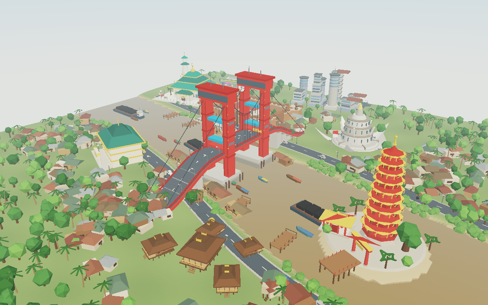

# Miniatur 3D Kota Palembang

Model 3D interaktif kota Palembang bergaya **diorama/maket**, dibangun dengan
[Three.js](https://threejs.org/) tanpa satu pun aset model eksternal — seluruh
bangunan dibentuk secara prosedural dari kode.



## Menjalankan

```bash
npm install
npm run dev      # buka http://localhost:5173
```

```bash
npm run build    # bundel produksi ke dist/
npm run preview
```

## Landmark yang dimodelkan

| # | Landmark | Keterangan |
|---|----------|------------|
| 1 | **Jembatan Ampera** | Dua menara merah kembar dengan jam, balok penggantung biru, kabel, dan jalan melengkung di atas Sungai Musi |
| 2 | **Masjid Agung SMB II** | Atap limas bersusun tiga dengan "tanduk" melengkung khas Palembang, menara bergaya Tiongkok |
| 3 | **Benteng Kuto Besak** | Benteng persegi dengan empat bastion bermeriam, gerbang menghadap sungai, dan plaza tepian |
| 4 | **Monpera** | Monumen berbentuk lima kelopak bunga melati yang merekah |
| 5 | **Pulau Kemaro** | Pagoda sembilan lantai, Klenteng Hok Tjing Rio, gapura, dan Pohon Cinta |
| 6 | **Kampung Rumah Limas** | Rumah adat panggung dengan lantai bertingkat (*kekijing*) dan ukiran simbar |
| 7 | **Rumah Rakit & Ketek** | Hunian terapung di atas rakit bambu, perahu ketek hilir mudik |
| 8 | **Al-Qur'an Al-Akbar** | Museum mushaf raksasa berukir pada lembaran kayu tembesu |
| 9 | **Pusat Kota Ilir** | Siluet gedung modern, Pasar 16 Ilir, dan jalan tepian |

## Fitur

- **Sungai Musi bergelombang** — shader air kustom: gelombang Gerstner, pantulan
  langit berbasis fresnel, kilau matahari, dan warna keruh khas Musi.
- **Tiga suasana waktu** — Pagi, Senja, dan Malam dengan transisi halus. Saat
  malam, lampu jembatan, lampion pagoda, jendela rumah, dan lampu jalan menyala.
- **Kota yang hidup** — perahu ketek dan kapal tongkang menyusuri sungai, mobil
  melintas di jalan tepian, rumah rakit bergoyang mengikuti riak air.
- **Navigasi interaktif** — klik landmark di scene atau daftar samping untuk
  terbang ke sana; mode Tur berkeliling otomatis.
- **Terrain prosedural** — dataran Seberang Ilir & Ulu, dasar sungai, dan delta
  Pulau Kemaro dihasilkan dari fungsi ketinggian yang sama dengan geometri sungai.

## Kontrol

| Aksi | Cara |
|------|------|
| Putar kamera | Tahan klik kiri lalu geser / satu jari |
| Geser peta | Klik kanan / dua jari |
| Zoom | Scroll / cubit |
| Fokus landmark | Klik bangunan atau item di daftar |
| Tur otomatis | Tombol **Tur** atau `Spasi` |
| Kembali ke awal | `R` |
| Pilih landmark 1–9 | Tombol angka `1`–`9` |
| Tutup panel | `Esc` |

## Struktur proyek

```
src/
  main.js            # bootstrap UI, label 3D, interaksi, tur
  scene.js           # perakitan scene, kamera, cahaya, animasi
  data.js            # metadata landmark & preset waktu
  lib/kit.js         # kit material/geometri prosedural bersama
  world/
    river.js         # geometri Sungai Musi (sumber kebenaran tunggal)
    terrain.js       # terrain vertex-colored + alas diorama
    water.js         # shader permukaan air
  models/
    ampera.js        # Jembatan Ampera
    masjid.js        # Masjid Agung SMB II
    benteng.js       # Benteng Kuto Besak
    monpera.js       # Monpera
    kemaro.js        # Pulau Kemaro
    city.js          # Al-Qur'an Al-Akbar, pusat kota, Pasar 16 Ilir
    vernacular.js    # Rumah Limas, rumah rakit, ketek, tongkang, dermaga
    scenery.js       # vegetasi, kampung, jalan tepian, lalu lintas
tools/               # alat verifikasi offline (tidak dipakai aplikasi)
```

### Alat verifikasi

Karena sandbox pengembangan tidak memiliki browser, repositori ini menyertakan
perender perangkat lunak untuk memeriksa komposisi 3D secara offline:

```bash
node tools/validate.mjs                        # cek geometri tiap modul
node tools/collide.mjs                         # cek tumpang tindih landmark
node tools/smoke.mjs                           # cek integritas data & preset
node tools/render.mjs malam out.png overview   # render PNG tanpa GPU
```

Sudut pandang yang tersedia: `overview`, `wide`, `top`, `ampera`, `masjid`,
`benteng`, `kemaro`, `limas`, `river`, `low`.

## Catatan

Model ini adalah **interpretasi miniatur bergaya diorama**, bukan rekonstruksi
berskala geografis. Proporsi dan tata letak landmark disederhanakan serta
dirapatkan agar seluruh ikon kota dapat terlihat dalam satu pandangan.
